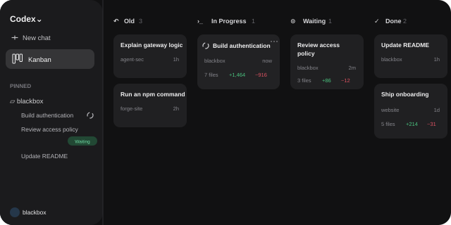
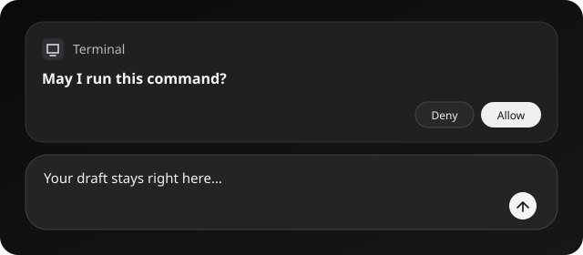
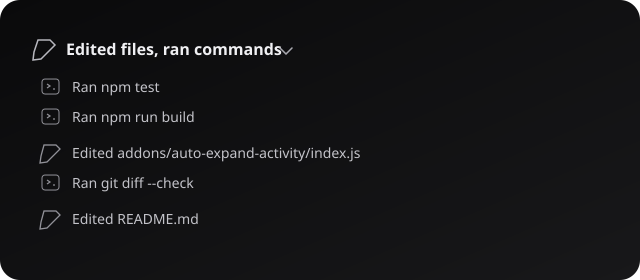
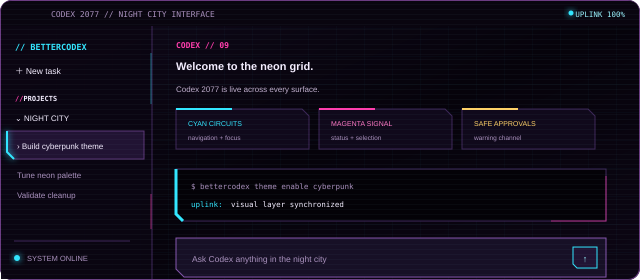

# BetterCodex

<p align="center">
  <strong>A cozy, extensible mod loader for the official ChatGPT Codex Windows app.</strong>
</p>

<p align="center">
  <a href="https://github.com/ijsbeerdev/BetterCodex/releases/tag/v0.4.0"></a>
  
</p>

BetterCodex adds a native-feeling add-on layer to ChatGPT Codex without rewriting the signed app package or `app.asar`. Install it once, keep receiving normal ChatGPT Codex updates, and open its compact settings hub from the robot icon beside **Help**.

> [!NOTE]
> BetterCodex is an unofficial community project and is not affiliated with or endorsed by OpenAI.

## ✨ What makes it better

- **Launch Codex normally** — a quiet, self-recovering per-user scheduled watcher handles injection from your existing Start menu or taskbar shortcut.
- **Safe runtime patching** — the signed MSIX package, Codex executables, `app.asar`, and update settings stay untouched.
- **One-click controls** — every add-on has a visible enable/disable switch in a settings view that follows Codex's light and dark themes.
- **Durable preferences** — add-on, tweak, theme, and feature state is backed up in the Windows user profile and survives patching or uninstalling BetterCodex.
- **Update checks** — check the latest GitHub release from BetterCodex settings and jump straight to it when an update is available.
- **Instant development** — core hot reload watches the client and add-on files, then reinjects changes without restarting Codex.
- **Built-in add-on generation** — start a focused Codex task with the exact scaffold, lifecycle, and installation requirements already attached.
- **Clean removal** — uninstalling removes the watcher, shortcuts, and BetterCodex runtime while leaving Codex and your saved BetterCodex preferences alone.

## 🧩 Included add-ons, tweaks, and themes

| Category | Feature | What it does |
| --- | --- | --- |
| Add-on | **Kanban** | Groups Codex tasks by live activity, approval state, completion, and code-change totals. |
| Theme | **Codex 2077** | Turns Codex into a neon night-city interface with cyan circuits and magenta signals. |
| Tweak | **Approval Shelf** | Keeps Codex's real composer and draft visible beneath approval prompts. |
| Tweak | **Auto Expand Activity** | Automatically opens collapsed command and file-edit activity in conversations. |

Included add-ons and tweaks are enabled by default. Themes are opt-in, and every add-on feature can be toggled independently from **BetterCodex settings**. Hot reload is part of the core runtime so it is always ready after patching.

<table>
  <tr>
    <td width="50%"><br><strong>Kanban</strong></td>
    <td width="50%"><br><strong>Approval Shelf</strong></td>
  </tr>
  <tr>
    <td width="50%"><br><strong>Auto Expand Activity</strong></td>
    <td width="50%"><br><strong>Codex 2077</strong></td>
  </tr>
</table>

## 📦 Install

1. Go to the [latest BetterCodex release](https://github.com/ijsbeerdev/BetterCodex/releases/latest).
2. Download the Windows x64 ZIP attached to that release.
3. Extract the **entire** ZIP.
4. Double-click **Install BetterCodex.cmd**.
5. If Codex is open, let it briefly restart while BetterCodex loads. Future launches load automatically.

The release includes its own verified portable runtime, so users do not need Node.js or npm. A clearly named per-user Scheduled Task keeps the watcher running in the background without a startup terminal or patching notifications. On first launch, the ChatGPT Codex window may briefly close while the watcher relaunches the fresh process with BetterCodex attached.

> [!TIP]
> After installation, look for the robot icon beside **Help** in the bottom-left account toolbar.

## 🛠️ Build from source

Source development requires Node.js 22 or newer.

```powershell
git clone https://github.com/ijsbeerdev/BetterCodex.git
cd BetterCodex
npm install
npm run build
npm run patch
```

Useful commands:

```powershell
npm test        # Run the test suite
npm run build   # Build the injectable runtime into dist/
npm run package # Create a self-contained Windows release ZIP
npm run unpatch # Remove a source installation
```

## 🧪 Build your own add-on

Each add-on lives in `addons/<id>/` and contains:

```text
addons/my-addon/
├── manifest.json
├── index.js
└── screenshot.svg
```

Add-ons register with `BetterCodex.register({ id, start, stop })`. `start()` activates the feature; cleanup-capable `stop()` reverses every DOM change, observer, listener, style, and timer when the add-on is disabled or hot-reloaded. The manifest supplies the metadata, including a `creator` label, optional public `shareUrl`, default state, screenshot, and an `addon`, `tweak`, or `theme` category shown in BetterCodex settings. Every catalog card can be shared through the system share sheet or, when provided, by copying its direct link.

The **Generate add-on**, **Generate tweak**, and **Generate theme** actions sit beside their catalog search bars. Each opens a fresh Codex task with the target directory and category-specific implementation requirements attached—just describe what you want. The requirements keep generated entries aligned with the current category, lifecycle conventions, and Codex's native components and visual language.

## 🔎 How it works

```text
Normal Codex launch
        ↓
Per-user watcher detects the fresh process
        ↓
Codex relaunches with a loopback-only debugging endpoint
        ↓
BetterCodex injects the client and enabled add-ons at runtime
```

The launcher resolves the newest installed Codex version every time, which lets regular Codex updates continue normally. The debugging endpoint remains loopback-only.

## 🧹 Uninstall

Release packages include **Uninstall BetterCodex.cmd**. Run it to stop and remove the watcher, runtime, and BetterCodex shortcuts. For a source install, run `npm run unpatch`.

The official ChatGPT Codex installation is never removed or modified.

BetterCodex stores its durable preference backup at `%APPDATA%\BetterCodex\preferences.json`. Patching and uninstalling preserve this small profile file so a later reinstall restores add-on, tweak, theme, and feature state.

## 🤝 Contributing

Issues and pull requests are welcome. Keep the UI cozy and compact, give every add-on a manifest and visible toggle, and make every `stop()` implementation fully reversible. Before opening a pull request, run:

```powershell
npm test
npm run build
```

The injection layer depends on Codex's renderer and may occasionally need an update when the app changes.
